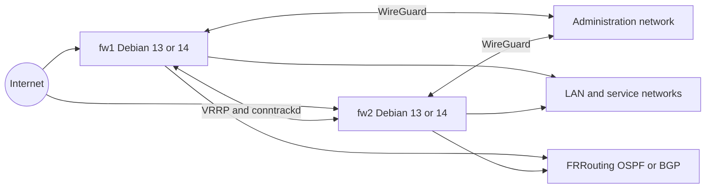

# Architecture

The deployment uses two Debian firewalls in an active-passive HA pair. Keepalived provides the virtual IP, conntrackd synchronizes connection state and WireGuard provides encrypted administration and service connectivity.

The Ansible roles manage the network layer, nftables policy, VPN services, routing, high availability and connection tracking. The virtual IP is owned by the active node and moves to the standby node during failover.
